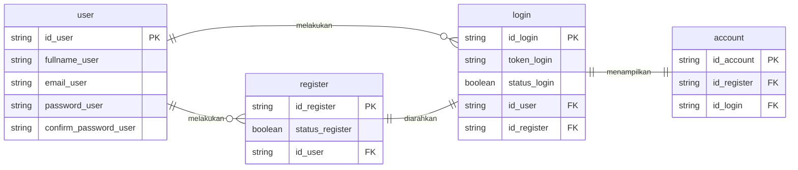

## ERD Authflow



<!-- ```mermaid
  erDiagram
  direction LR
  account {
    string id_account PK
    string id_login FK
    string id_register FK
  }
  login {
    string id_login PK
    string username
    string email
    string password
    string id_register FK
  }
  register {
    string id_register PK
    string name
    int age
  }
``` -->