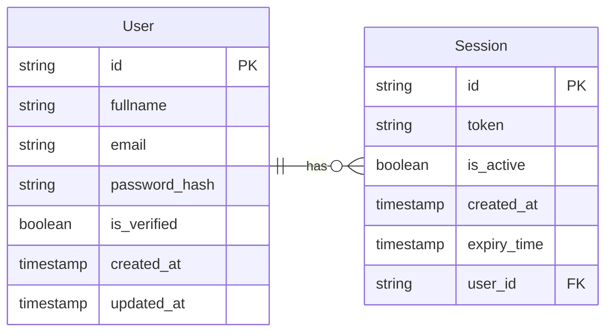

## ERD Authflow

```mermaid
erDiagram
  direction LR
  User ||--o{ Session : "has"
  User {
    string id PK
    string fullname
    string email
    string password_hash
    boolean is_verified
    timestamp created_at
    timestamp updated_at
  }
  Session {
    string id PK
    string token
    boolean is_active
    timestamp created_at
    timestamp expiry_time
    string user_id FK
  }
```